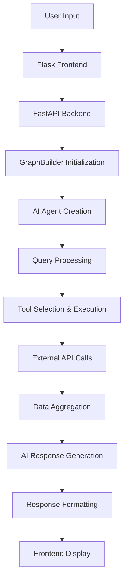

# Guidely.ai - Project Documentation

## Table of Contents
- [Project Overview](#project-overview)
- [Project Architecture](#project-architecture)
- [Technology Stack](#technology-stack)
- [Project Structure](#project-structure)
- [Core Components](#core-components)
- [Workflows and Operational Logic](#workflows-and-operational-logic)
- [Dependencies and Configuration](#dependencies-and-configuration)
- [Setup Instructions](#setup-instructions)
- [Usage Instructions](#usage-instructions)
- [API Documentation](#api-documentation)
- [Key Algorithms and Implementations](#key-algorithms-and-implementations)
- [Frontend Architecture](#frontend-architecture)
- [Error Handling and Logging](#error-handling-and-logging)
- [Development Guidelines](#development-guidelines)
- [Troubleshooting](#troubleshooting)
- [Contributing](#contributing)

## Project Overview

Guidely.ai is an AI-powered travel planning application that helps users create comprehensive travel itineraries. The system generates both mainstream tourist plans and unique off-the-beaten-path experiences using advanced AI technology powered by LangGraph and Groq LLM.

### Key Features
- **Dual Planning Approach**: Provides both popular tourist attractions and unique local experiences
- **Real-time Data Integration**: Uses live APIs for weather, places, currency conversion, and search
- **Comprehensive Planning**: Includes accommodations, activities, restaurants, transportation, and budget calculations
- **Modern Web Interface**: Beautiful, responsive UI with dark/light theme support
- **AI-Powered Intelligence**: LangGraph-based agentic workflow with tool integration

## Project Architecture

The application follows a **microservices architecture** with clear separation between frontend and backend:

```
┌─────────────────┐    ┌──────────────────┐    ┌─────────────────┐
│   Frontend      │    │   Backend API    │    │  External APIs  │
│   (Flask)       │───▶│   (FastAPI)      │───▶│  - OpenWeather  │
│   - UI/UX       │    │   - AI Agent     │    │  - Tavily Search│
│   - Chat Interface│   │   - Tool Router  │    │  - Currency API │
│   - Theme System│    │   - LLM Chain    │    │  - Places API   │
└─────────────────┘    └──────────────────┘    └─────────────────┘
```

### Architecture Layers

1. **Presentation Layer** (`app.py`, `templates/`, `static/`)
   - Flask web application serving the user interface
   - Responsive design with modern CSS and JavaScript
   - Real-time chat interface

2. **API Gateway Layer** (`main.py`)
   - FastAPI application handling AI processing requests
   - Request/response validation with Pydantic models
   - Error handling and logging

3. **Business Logic Layer** (`src/agent/`)
   - LangGraph-based agentic workflow
   - Tool orchestration and execution
   - AI reasoning and decision making

4. **Service Layer** (`src/tools/`, `src/utils/`)
   - External API integrations
   - Utility functions and helpers
   - Data processing and calculations

5. **Infrastructure Layer** (`src/config/`, `src/logger/`, `src/exception/`)
   - Configuration management
   - Logging and monitoring
   - Exception handling

## Technology Stack

### Backend Technologies
- **Python 3.13+**: Core programming language
- **FastAPI**: High-performance web framework for AI API
- **Flask**: Web framework for frontend application
- **LangGraph**: AI agent workflow orchestration
- **LangChain**: LLM integration and tool management
- **Groq**: High-speed LLM inference
- **Pydantic**: Data validation and serialization

### AI & ML Stack
- **Groq LLM**: Primary language model (configurable)
- **LangChain Tools**: Tool integration framework
- **Tavily Search**: Real-time web search capabilities
- **OpenWeatherMap API**: Weather data integration
- **Google Places API**: Location and place search
- **Currency Exchange API**: Real-time currency conversion

### Frontend Technologies
- **HTML5/CSS3**: Modern responsive design
- **JavaScript (ES6+)**: Interactive functionality
- **CSS Variables**: Theme system implementation
- **Markdown Parsing**: Rich content rendering
- **Local Storage**: Chat history persistence

### DevOps & Tools
- **uv**: Modern Python package management
- **python-dotenv**: Environment variable management
- **colorlog**: Enhanced logging with colors
- **YAML**: Configuration file format

## Project Structure

```
Guidely.ai/
├── src/                          # Source code directory
│   ├── agent/                    # AI Agent implementation
│   │   ├── __init__.py
│   │   └── agentic_workflow.py   # Main LangGraph workflow
│   ├── config/                   # Configuration management
│   │   ├── __init__.py
│   │   ├── config.yaml           # App configuration
│   │   └── configuration.py      # Config loader utilities
│   ├── exception/                # Custom exception handling
│   │   └── __init__.py
│   ├── logger/                   # Logging system
│   │   └── __init__.py
│   ├── prompts/                  # AI prompts and templates
│   │   ├── __init__.py
│   │   └── system_prompt.py      # Main system prompt
│   ├── tools/                    # LangChain tools
│   │   ├── __init__.py
│   │   ├── weather_info_tool.py  # Weather API integration
│   │   ├── place_search_tool.py  # Place search functionality
│   │   ├── expense_calculator_tool.py # Budget calculations
│   │   └── currency_converter_tool.py # Currency conversion
│   └── utils/                    # Utility functions
│       ├── __init__.py
│       ├── models.py             # Pydantic models & LLM loader
│       ├── weather_info.py       # Weather service implementation
│       ├── place_search.py       # Place search service
│       ├── expense_calculator.py # Calculator utilities
│       └── currency_converter.py # Currency service
├── templates/                    # HTML templates
│   ├── base.html                 # Base template
│   ├── index.html               # Homepage with chat interface
│   ├── about.html               # About page
│   ├── features.html            # Features page
│   └── contact.html             # Contact page
├── static/                       # Static assets
│   ├── css/
│   │   └── styles.css           # Main stylesheet
│   ├── js/
│   │   └── main.js              # Frontend JavaScript
│   └── img/
│       └── logo.png             # Application logo
├── main.py                      # FastAPI backend server
├── app.py                       # Flask frontend server
├── pyproject.toml              # Project configuration
├── requirements.txt            # Python dependencies
├── uv.lock                     # Dependency lock file
├── .env.example               # Environment variables template
├── .gitignore                 # Git ignore rules
├── .python-version           # Python version specification
└── README.md                 # Basic project description
```

## Core Components

### 1. AI Agent Workflow (`src/agent/agentic_workflow.py`)

The heart of the application is the `GraphBuilder` class that creates a LangGraph-based AI agent:

```python
class GraphBuilder:
    def __init__(self, model_provider: str = "groq"):
        # Initialize LLM and tools
        self.model_loader = ModelLoader(model_provider=model_provider)
        self.llm = self.model_loader.load_llm()
        
        # Initialize all tools
        self.weather_tools = WeatherInfoTool()
        self.place_search_tools = PlaceSearchTool()
        self.calculator_tools = CalculatorTool()
        self.currency_converter_tools = CurrencyConverterTool()
        
        # Bind tools to LLM
        self.llm_with_tools = self.llm.bind_tools(tools=self.tools)
```

**Key Features:**
- **Tool Integration**: Seamlessly combines multiple external APIs
- **Graph-based Workflow**: Uses LangGraph for complex reasoning chains
- **Error Handling**: Comprehensive exception management
- **Configurable**: Supports different LLM providers

### 2. Tool System (`src/tools/`)

The application uses a modular tool system with four main categories:

#### Weather Information Tool
- **Current Weather**: Real-time weather data for any city
- **Weather Forecast**: Multi-day weather predictions
- **Temperature and Conditions**: Detailed weather descriptions

#### Place Search Tool
- **Attractions**: Popular and off-beat tourist destinations
- **Restaurants**: Local dining recommendations
- **Activities**: Things to do and experiences
- **Transportation**: Available transport options
- **Hotels**: Accommodation recommendations

#### Expense Calculator Tool
- **Hotel Cost Calculation**: Price per night × total days
- **Total Expense Calculation**: Sum of all trip expenses
- **Daily Budget Calculation**: Total cost ÷ number of days

#### Currency Converter Tool
- **Real-time Exchange Rates**: Live currency conversion
- **Multi-currency Support**: Support for major world currencies
- **API Integration**: Uses ExchangeRate API for accuracy

### 3. Model Management (`src/utils/models.py`)

Sophisticated model loading and configuration system:

```python
class ModelLoader(BaseModel):
    def load_llm(self):
        # Load model configuration
        model_name = self.config['llm']['groq']['model_name']
        groq_api_key = os.getenv("GROQ_API_KEY")
        
        # Initialize and return LLM
        return ChatGroq(model=model_name, api_key=groq_api_key)
```

### 4. Configuration System (`src/config/`)

YAML-based configuration with Python integration:
- **Flexible Configuration**: Easy modification of model settings
- **Environment Integration**: Seamless environment variable support
- **Error Handling**: Robust configuration loading with fallbacks

## Workflows and Operational Logic

### 1. User Query Processing Flow



### 2. AI Agent Decision Process

1. **Query Analysis**: The AI analyzes the user's travel request
2. **Tool Selection**: Determines which tools are needed (weather, places, currency, etc.)
3. **Parallel Execution**: Executes multiple API calls simultaneously when possible
4. **Data Integration**: Combines results from different sources
5. **Plan Generation**: Creates both mainstream and off-beat travel plans
6. **Response Formatting**: Structures the response in markdown format

### 3. Tool Execution Logic

Each tool follows a consistent pattern:
- **Input Validation**: Validates parameters using Pydantic models
- **API Integration**: Calls external services with proper error handling
- **Data Processing**: Normalizes and structures response data
- **Result Formatting**: Returns data in a consistent format for the AI

### 4. Error Handling Flow

```python
try:
    # Tool execution
    result = api_call(parameters)
    return process_result(result)
except APIException as e:
    logger.error(f"API error: {e}")
    raise CustomException(f"Service unavailable: {e}")
except Exception as e:
    logger.exception("Unexpected error")
    raise CustomException(f"Internal error: {e}")
```

## Dependencies and Configuration

### Core Dependencies

**AI & LLM Framework:**
```toml
langchain = ">=0.3.27"
langchain-groq = ">=0.3.8"
langgraph = ">=0.6.8"
langsmith = ">=0.4.31"
```

**Web Frameworks:**
```toml
fastapi = ">=0.118.0"
flask = ">=3.1.2"
uvicorn = ">=0.37.0"
```

**External Integrations:**
```toml
httpx = ">=0.28.1"
requests = ">=2.32.5"
langchain-tavily = ">=0.2.11"
langchain-google-community = ">=2.0.10"
```

**Utilities:**
```toml
pydantic = ">=2.11.9"
python-dotenv = ">=1.1.1"
colorlog = ">=6.9.0"
```

### Environment Configuration

Required environment variables (`.env`):

```env
# LLM Configuration
GROQ_API_KEY=your_groq_api_key_here

# External API Keys
GOOGLE_API_KEY=your_google_api_key_here
TAVILY_API_KEY=your_tavily_api_key_here
OPENWEATHERMAP_API_KEY=your_openweather_api_key_here
EXCHANGE_RATE_API_KEY=your_exchange_rate_api_key_here
FOURSQUARE_API_KEY=your_foursquare_api_key_here

# Optional Configuration
BACKEND_URL=http://localhost:8000
PORT=5000
```

### Application Configuration (`src/config/config.yaml`)

```yaml
llm:
  groq:
    provider: "groq"
    model_name: "openai/gpt-oss-20b"
```

## Setup Instructions

### Prerequisites
- Python 3.13 or higher
- Git
- API keys for external services

### Installation Steps

1. **Clone the Repository**
   ```bash
   git clone <repository-url>
   cd Guidely.ai
   ```

2. **Set up Python Environment**
   ```bash
   # Using uv (recommended)
   pip install uv
   uv venv
   source .venv/bin/activate  # On Windows: .venv\Scripts\activate
   
   # Or using traditional venv
   python -m venv .venv
   source .venv/bin/activate
   ```

3. **Install Dependencies**
   ```bash
   # Using uv
   uv pip install -r requirements.txt
   
   # Or using pip
   pip install -r requirements.txt
   ```

4. **Configure Environment Variables**
   ```bash
   cp .env.example .env
   # Edit .env file with your API keys
   ```

5. **Obtain API Keys**
   - **Groq**: Sign up at [groq.com](https://groq.com) for LLM access
   - **Google**: Get API key from Google Cloud Console for Places API
   - **Tavily**: Register at [tavily.com](https://tavily.com) for search capabilities
   - **OpenWeatherMap**: Get free API key from [openweathermap.org](https://openweathermap.org)
   - **Exchange Rate API**: Sign up at [exchangerate-api.com](https://exchangerate-api.com)

6. **Test the Installation**
   ```bash
   python -c "from src.agent.agentic_workflow import GraphBuilder; print('Setup successful!')"
   ```

### Development Setup

For development, additional steps:

1. **Install Development Tools**
   ```bash
   pip install pytest black flake8 mypy
   ```

2. **Set up Pre-commit Hooks** (optional)
   ```bash
   pip install pre-commit
   pre-commit install
   ```

## Usage Instructions

### Starting the Application

The application consists of two servers that need to be running simultaneously:

1. **Start the Backend API Server (FastAPI)**
   ```bash
   python main.py
   # Server will start on http://localhost:8000
   ```

2. **Start the Frontend Web Server (Flask)**
   ```bash
   python app.py
   # Server will start on http://localhost:5000
   ```

### Using the Web Interface

1. **Access the Application**
   - Open your browser to `http://localhost:5000`
   - The homepage provides an overview and chat interface

2. **Chat with the AI Agent**
   - Type your travel request in the chat input
   - Example queries:
     - "Plan a 7-day romantic trip to Paris in spring with museums and fine dining"
     - "5-day adventure in Tokyo with temples, food markets, and modern culture"
     - "Week-long backpacking trip to Costa Rica focused on wildlife and beaches"

3. **Review Generated Plans**
   - The AI provides both mainstream and off-beat travel plans
   - Each plan includes detailed itineraries, costs, and recommendations
   - Plans are formatted in markdown for easy reading

### Using the API Directly

**Endpoint**: `POST /query`

**Request Format**:
```json
{
  "query": "Plan a 5-day trip to Tokyo with cultural experiences and local food"
}
```

**Response Format**:
```json
{
  "answer": "Detailed travel plan in markdown format..."
}
```

**cURL Example**:
```bash
curl -X POST http://localhost:8000/query \
  -H "Content-Type: application/json" \
  -d '{"query": "Plan a weekend getaway to Barcelona"}'
```

### Best Practices for Queries

**Effective Query Structure:**
- **Destination**: Specify the city/country you want to visit
- **Duration**: Mention how many days you're planning
- **Interests**: Include your preferences (culture, food, adventure, relaxation)
- **Budget**: Optionally mention budget constraints
- **Season**: Specify travel dates or season for weather-appropriate suggestions

**Example Effective Queries:**
- ✅ "Plan a 4-day cultural trip to Kyoto in autumn, interested in temples, traditional food, and avoiding crowds"
- ✅ "Weekend trip to Amsterdam for art lovers on a mid-range budget"
- ❌ "Tell me about Paris" (too vague)
- ❌ "Trip" (insufficient information)

## API Documentation

### FastAPI Endpoints

#### POST /query
**Description**: Main endpoint for travel planning requests

**Parameters**:
- `query` (string, required): The travel planning request

**Response**:
- `answer` (string): Comprehensive travel plan in markdown format

**Status Codes**:
- `200`: Successful response
- `400`: Invalid request format
- `500`: Internal server error

**Request Example**:
```python
import requests

response = requests.post(
    'http://localhost:8000/query',
    json={'query': 'Plan a 3-day trip to Rome with historical sites and Italian cuisine'}
)

data = response.json()
print(data['answer'])
```

### Flask Routes

#### GET /
Homepage with chat interface and project overview

#### GET /about
Information about the project and its capabilities

#### GET /features
Detailed feature descriptions and use cases

#### GET /contact
Contact information and developer links

#### POST /query
Proxy endpoint that forwards requests to the FastAPI backend

## Key Algorithms and Implementations

### 1. LangGraph Workflow Algorithm

The core AI workflow uses a state-based graph approach:

```python
def build_graph(self):
    graph_builder = StateGraph(MessagesState)
    
    # Add nodes
    graph_builder.add_node("agent", self.agent_function)
    graph_builder.add_node("tools", ToolNode(tools=self.tools))
    
    # Define execution flow
    graph_builder.add_edge(START, "agent")
    graph_builder.add_conditional_edges("agent", tools_condition)
    graph_builder.add_edge("tools", "agent")
    graph_builder.add_edge("agent", END)
    
    return graph_builder.compile()
```

**Algorithm Benefits**:
- **Conditional Execution**: Tools are called only when needed
- **Stateful Processing**: Maintains context across tool calls
- **Error Recovery**: Graceful handling of tool failures
- **Parallel Processing**: Multiple tools can execute simultaneously

### 2. Tool Selection Algorithm

The AI uses intelligent tool selection based on query analysis:

```python
def agent_function(self, state: MessagesState) -> dict:
    user_question = state["messages"]
    input_question = [self.system_prompt] + user_question
    
    # LLM analyzes query and selects appropriate tools
    response = self.llm_with_tools.invoke(input_question)
    return {"messages": [response]}
```

### 3. Currency Conversion Algorithm

Real-time currency conversion with caching:

```python
def convert(self, amount: float, from_currency: str, to_currency: str) -> float:
    url = f"{self.base_url}/{from_currency.upper()}"
    response = requests.get(url)
    
    if response.status_code == 200:
        data = response.json()
        rates = data.get("conversion_rates")
        converted_amount = amount * rates[to_currency.upper()]
        return converted_amount
```

### 4. Expense Calculation Algorithms

**Daily Budget Calculation**:
```python
def calculate_daily_budget(self, total_cost: float, days: int) -> float:
    if days <= 0:
        raise ValueError("Number of days must be greater than zero.")
    return float(total_cost) / days
```

**Total Expense Aggregation**:
```python
def calculate_total(*costs: float) -> float:
    return sum(costs)
```

### 5. Data Normalization Algorithm

Consistent data formatting across all tools:

```python
def _normalize_result(self, source: str, category: str, place: str, 
                     result: Any, error: str = None) -> Dict:
    return {
        "source": source,
        "category": category,
        "place": place,
        "error": error,
        "results": result if result else []
    }
```

## Frontend Architecture

### 1. Theme System

CSS-based theme system with JavaScript control:

```javascript
function applyTheme(theme) {
    const htmlEl = document.documentElement
    if (theme === "dark") {
        htmlEl.classList.add("dark")
    } else {
        htmlEl.classList.remove("dark")
    }
}
```

**Features**:
- **System Preference Detection**: Automatically detects user's preferred theme
- **Persistent Storage**: Remembers user's theme choice
- **Smooth Transitions**: Animated theme switching
- **Accessibility**: High contrast mode support

### 2. Chat Interface

Modern chat interface with real-time interaction:

```javascript
async function sendQuery(query) {
    const res = await fetch("/query", {
        method: "POST",
        headers: { "Content-Type": "application/json" },
        body: JSON.stringify({ query }),
    })
    return await res.json()
}
```

**Features**:
- **Local Storage**: Chat history persistence
- **Markdown Rendering**: Rich text display for AI responses
- **Loading States**: Visual feedback during processing
- **Error Handling**: User-friendly error messages

### 3. Responsive Design

Mobile-first responsive design with modern CSS:

```css
@media (max-width: 900px) {
    .hero {
        grid-template-columns: 1fr;
        gap: var(--space-8);
        text-align: center;
    }
}
```

**Features**:
- **Flexible Grid System**: Adapts to different screen sizes
- **Touch-friendly**: Optimized for mobile interactions
- **Performance**: Optimized CSS with minimal JavaScript
- **Accessibility**: Screen reader support and keyboard navigation

## Error Handling and Logging

### 1. Custom Exception System

Comprehensive exception handling with detailed logging:

```python
class CustomException(Exception):
    def __init__(self, error_message: str, error_details: sys = sys):
        super().__init__(error_message)
        self.error_message = error_message
        
        if error_details is not None:
            _, _, exc_tb = error_details.exc_info()
            self.filename = exc_tb.tb_frame.f_code.co_filename
            self.lineno = exc_tb.tb_lineno
        
        logger.error(self.__str__())
```

### 2. Structured Logging

Multi-level logging with file rotation and color coding:

```python
class Logger:
    @classmethod
    def get_logger(cls, name="AppLogger"):
        logger = logging.getLogger(name)
        
        # File handler with rotation
        file_handler = RotatingFileHandler(
            log_file_path, maxBytes=5*1024*1024, backupCount=3
        )
        
        # Console handler with colors
        console_handler = logging.StreamHandler(sys.stdout)
        if colorlog:
            formatter = colorlog.ColoredFormatter(...)
        
        return logger
```

**Features**:
- **Log Rotation**: Automatic log file management
- **Colored Output**: Enhanced readability in terminal
- **Unicode Support**: Handles international characters
- **Multiple Levels**: Debug, info, warning, error, critical

### 3. Error Recovery Strategies

**API Failures**:
- Retry mechanisms for transient failures
- Fallback responses when services are unavailable
- Graceful degradation of functionality

**Validation Errors**:
- Pydantic model validation with clear error messages
- Input sanitization and normalization
- User-friendly error responses

## Development Guidelines

### 1. Code Structure

**File Organization**:
- Follow the established directory structure
- Keep related functionality together
- Use descriptive file and function names

**Import Organization**:
```python
# Standard library imports
import os
import sys

# Third-party imports
from fastapi import FastAPI
from langchain import tools

# Local imports
from src.logger import logger
from src.exception import CustomException
```

### 2. Adding New Tools

To add a new tool to the system:

1. **Create Tool Implementation** (`src/utils/new_tool.py`):
```python
class NewToolService:
    def __init__(self, api_key: str):
        self.api_key = api_key
    
    def execute_function(self, parameters):
        # Implement tool logic
        pass
```

2. **Create LangChain Tool Wrapper** (`src/tools/new_tool.py`):
```python
class NewTool:
    def __init__(self):
        self.service = NewToolService(os.getenv("NEW_TOOL_API_KEY"))
        self.tool_list = self._setup_tools()
    
    def _setup_tools(self):
        @tool
        def new_tool_function(param: str) -> str:
            """Tool description for the AI"""
            return self.service.execute_function(param)
        
        return [new_tool_function]
```

3. **Register Tool in Workflow** (`src/agent/agentic_workflow.py`):
```python
def __init__(self):
    # ... existing tools ...
    self.new_tool = NewTool()
    
    self.tools = [
        # ... existing tools ...
        *self.new_tool.tool_list,
    ]
```

### 3. Testing Guidelines

**Unit Tests**:
```python
def test_currency_conversion():
    converter = CurrencyConverter("test_api_key")
    # Mock the API response
    with patch('requests.get') as mock_get:
        mock_get.return_value.json.return_value = {
            'conversion_rates': {'EUR': 0.85}
        }
        result = converter.convert(100, 'USD', 'EUR')
        assert result == 85.0
```

**Integration Tests**:
- Test complete workflow from user input to response
- Verify tool interactions
- Test error handling scenarios

### 4. Configuration Management

**Adding New Configuration**:
1. Update `config.yaml` with new settings
2. Modify `configuration.py` if needed
3. Update environment variable documentation

**Best Practices**:
- Use environment variables for sensitive data
- Provide sensible defaults in configuration files
- Validate configuration on startup

## Troubleshooting

### Common Issues and Solutions

#### 1. API Key Issues

**Problem**: `GROQ_API_KEY not found in environment variables`
**Solution**:
```bash
# Check if .env file exists and has correct format
cat .env
# Ensure no spaces around the equals sign
GROQ_API_KEY=your_actual_api_key_here
```

#### 2. Tool Import Errors

**Problem**: `ImportError: langchain_groq is not installed`
**Solution**:
```bash
# Reinstall dependencies
pip install --upgrade langchain-groq
# Or using uv
uv pip install langchain-groq
```

#### 3. Port Conflicts

**Problem**: `Address already in use: 8000`
**Solution**:
```bash
# Find and kill process using the port
lsof -ti:8000 | xargs kill -9
# Or use different port
uvicorn main:app --port 8001
```

#### 4. Memory Issues

**Problem**: High memory usage during processing
**Solutions**:
- Implement request timeouts
- Use streaming responses for large outputs
- Monitor and limit concurrent requests

#### 5. External API Failures

**Problem**: External APIs returning errors or timeouts
**Solutions**:
- Check API key validity and quotas
- Implement retry mechanisms
- Add fallback responses
- Monitor API status pages

### Debugging Tips

**Enable Debug Logging**:
```python
import logging
logging.basicConfig(level=logging.DEBUG)
```

**API Response Inspection**:
```python
logger.debug(f"Raw agent output: {output}")
logger.debug(f"Tool results: {tool_results}")
```

**Network Issues**:
```bash
# Test API connectivity
curl -X GET "https://api.openweathermap.org/data/2.5/weather?q=London&appid=YOUR_API_KEY"
```

### Performance Optimization

**Database Optimization**:
- Implement caching for frequently requested data
- Use connection pooling for external APIs
- Consider Redis for session storage

**Response Time Improvement**:
- Implement parallel tool execution
- Cache exchange rates and weather data
- Use CDN for static assets

**Memory Management**:
- Implement request/response streaming
- Clear unused variables
- Monitor memory usage patterns

## Contributing

### Development Workflow

1. **Fork the Repository**
   ```bash
   git clone <your-fork-url>
   cd Guidely.ai
   ```

2. **Create Feature Branch**
   ```bash
   git checkout -b feature/new-feature-name
   ```

3. **Make Changes**
   - Follow the existing code structure
   - Add appropriate tests
   - Update documentation

4. **Test Changes**
   ```bash
   python -m pytest tests/
   python -m flake8 src/
   ```

5. **Commit and Push**
   ```bash
   git add .
   git commit -m "Add: Description of new feature"
   git push origin feature/new-feature-name
   ```

6. **Create Pull Request**
   - Provide clear description of changes
   - Include test results
   - Reference any related issues

### Code Standards

**Python Style**:
- Follow PEP 8 style guidelines
- Use type hints where appropriate
- Write descriptive docstrings
- Keep functions focused and small

**Documentation**:
- Update README.md for user-facing changes
- Update this documentation for architectural changes
- Add inline comments for complex logic
- Provide examples for new features

**Testing**:
- Write unit tests for new functions
- Add integration tests for new workflows
- Ensure all tests pass before submitting
- Aim for good test coverage

### Reporting Issues

When reporting bugs or requesting features:

1. **Check Existing Issues**: Look for similar reports first
2. **Provide Context**: Include system information and logs
3. **Reproduction Steps**: Clear steps to reproduce the issue
4. **Expected vs Actual**: Describe what should happen vs what does happen
5. **Environment Details**: Python version, OS, dependency versions

---

**Project Maintainer**: Arpit Kadam  
**Last Updated**: December 2024  
**Version**: 1.0.0

For additional support or questions, please refer to the contact information in the application or create an issue in the repository.
